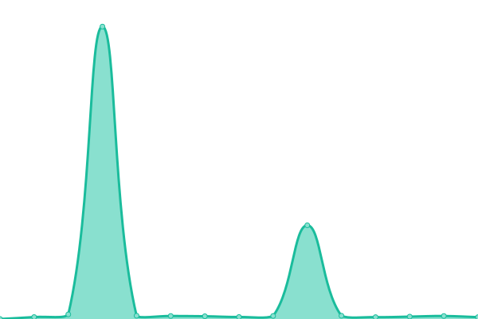
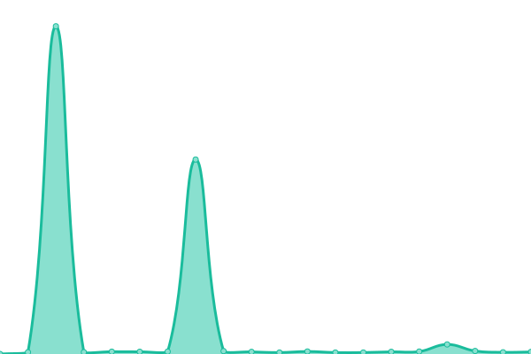

# [📈 Live Status](https://Space-Turtle0.github.io/PortalBOT-Hosting): <!--live status--> **🟥 Complete outage**

This repository contains the open-source uptime monitor and status page for [Space-Turtle0](https://Space-Turtle0.github.io/PortalBOT-Hosting), powered by [Upptime](https://github.com/upptime/upptime).

With [Upptime](https://upptime.js.org), you can get your own unlimited and free uptime monitor and status page, powered entirely by a GitHub repository. We use [Issues](https://github.com/Space-Turtle0/PortalBOT-Hosting/issues) as incident reports, [Actions](https://github.com/Space-Turtle0/PortalBOT-Hosting/actions) as uptime monitors, and [Pages](https://Space-Turtle0.github.io/PortalBOT-Hosting) for the status page.

<!--start: status pages-->
<!-- This summary is generated by Upptime (https://github.com/upptime/upptime) -->
<!-- Do not edit this manually, your changes will be overwritten -->
<!-- prettier-ignore -->
| URL | Status | History | Response Time | Uptime |
| --- | ------ | ------- | ------------- | ------ |
|  STABLE | 🟥 Down | [stable.yml](https://github.com/Space-Turtle0/PortalBOT-Hosting/commits/HEAD/history/stable.yml) | 

 512ms
     
 | 

<a href="https://Space-Turtle0.github.io/PortalBOT-Hosting/history/stable">99.09%</a>
    

|  BETA | 🟥 Down | [beta.yml](https://github.com/Space-Turtle0/PortalBOT-Hosting/commits/HEAD/history/beta.yml) | 

 0ms
     
 | 

<a href="https://Space-Turtle0.github.io/PortalBOT-Hosting/history/beta">0.00%</a>
    

<!--end: status pages-->

[**Visit our status website →**](https://Space-Turtle0.github.io/PortalBOT-Hosting)

## 📄 License

- Powered by: [Upptime](https://github.com/upptime/upptime)
- Code: [MIT](./LICENSE) © [Space-Turtle0](https://Space-Turtle0.github.io/PortalBOT-Hosting)
- Data in the `./history` directory: [Open Database License](https://opendatacommons.org/licenses/odbl/1-0/)
